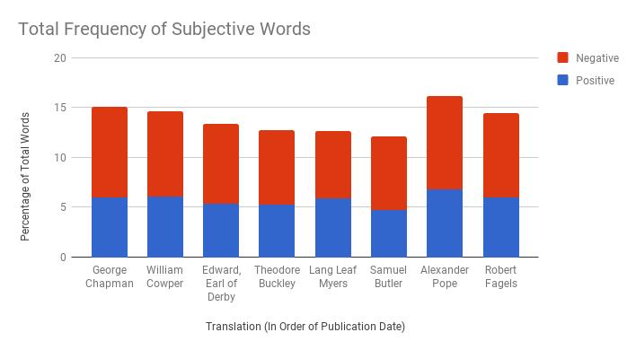
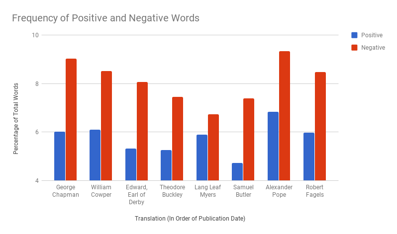
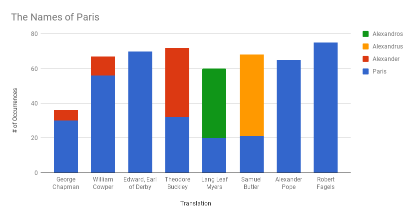
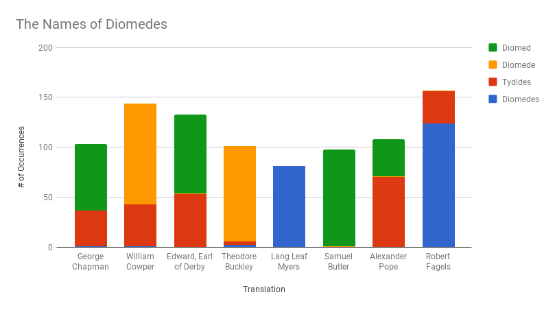
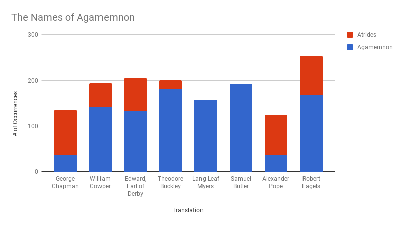

# iliad-nlp
Comparing different translations of the Iliad with statistical analysis.
For a small demo of this project, visit [my website](http://www.graysonpike.com/iliad/).

### Project Information

Directory Structure

- `translations/`
    - `raw/` - UTF-8 Text as Provided by Project Gutenberg
    - `cleaned/` - Text suitable for analysis. Removed tags, footnotes, and illustration regerences
- `dictionaries/`
    - `subjectivity_dict.tff` - Formatted list of subjective english words. Tagged with strength, part-of-speech, word stem, and polarity.

Types of Analysis:

#### Positive/Negative Word Ratios
Each word in the text is categorized as positive, negative, or neutral. The ratio of positive to words to all words and the ratio of negative words to all words is reported for each translation.

#### Keyword Frequency
The number of occurrences of given keywords is determined for each text. This is especially useful for identifying the use of alternative names.

### Results and Data

